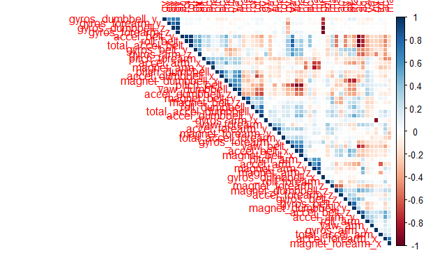
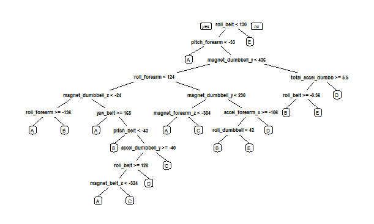

        
## Introduction  
Using devices such as Jawbone Up, Nike FuelBand, and Fitbit it is now possible to collect a large amount of data about personal activity relatively inexpensively. These type of devices are part of the quantified self movement - a group of enthusiasts who take measurements about themselves regularly to improve their health, to find patterns in their behavior, or because they are tech geeks. One thing that people regularly do is quantify how much of a particular activity they do, but they rarely quantify how well they do it.  

In this project, we will use data from accelerometers on the belt, forearm, arm, and dumbell of 6 participants to predict the manner in which they did the exercise.  

With this data, we should be able to classify the performance of their physical activity as:
        
A: exactly according to the exercise specification

B: throwing the elbows to the front

C: lifting the dumbbell only halfway

D: lowering the dumbbell only halfway

E: throwing the hips to the front


All data and project information is based on the findings and research of the LES Group at PUC-Rio. More info about the project and the data can be found at:

http://groupware.les.inf.puc-rio.br/har

## Basic Setup  

The following code first cleans our R environment and loads the libraries we will need: caret, rpart and randomForest for preprocessing, training and testing, and rpart.plot and corrplot for data exploration and general plotting. 

Then the code downloads the files containing the training and testing sets for our model.

```r
rm(list = ls(all.names = TRUE))
library(caret)
library(rpart)
library(rpart.plot)
library(randomForest)
library(corrplot)

trainUrl <-"https://d396qusza40orc.cloudfront.net/predmachlearn/pml-training.csv"
testUrl <- "https://d396qusza40orc.cloudfront.net/predmachlearn/pml-testing.csv"
trainFile <- "./data/pml-training.csv"
testFile  <- "./data/pml-testing.csv"
if (!file.exists("./data")) {
        dir.create("./data")
}
if (!file.exists(trainFile)) {
        download.file(trainUrl, destfile=trainFile)
}
if (!file.exists(testFile)) {
        download.file(testUrl, destfile=testFile)
}
```
### Loading the data
We can now load the csv files into our R environment. We should do this only once, avoiding time-consuming reloading.  

```r
if(!("testRaw" %in% ls())){
        testRaw <- read.csv("./data/pml-testing.csv")
}

if(!("trainRaw" %in% ls())){
        trainRaw <- read.csv("./data/pml-training.csv")
}
dim(trainRaw)
```

```
[1] 19622   160
```

```r
dim(testRaw)
```

```
[1]  20 160
```
The training dataset contains 19622 observations and 160 variables and the testing dataset contains 20 observations and 160 variables. 
The "classe" variable represents the exercise quality and it is the variable we will try to predict. 

### Preprocessing: cleaning the data
We should first clean up the data - we will remove observations with missing values.Then we should remove columns that do not contribute much to the accelerometer measurements. Those are timestamp variables: it doesn't matter to the model in which day or hour the measurements were taken!


```r
trainRaw <- trainRaw[, colSums(is.na(trainRaw)) == 0] 
testRaw <- testRaw[, colSums(is.na(testRaw)) == 0] 

classe <- trainRaw$classe

trainRemove <- grepl("^X|timestamp|window", names(trainRaw))
trainRaw <- trainRaw[, !trainRemove]
trainCleaned <- trainRaw[, sapply(trainRaw, is.numeric)]

trainCleaned$classe <- classe

testRemove <- grepl("^X|timestamp|window", names(testRaw))
testRaw <- testRaw[, !testRemove]
testCleaned <- testRaw[, sapply(testRaw, is.numeric)]

dim(testCleaned)
```
## [1] 20 53

```r
dim(trainCleaned)
```
## [1] 19622    53

The cleaned training dataset contains 19622 observations and 53 variables and the testing dataset contains 20 observations and 53 variables. 


### Training and validation datasets
We should split the training set in 2 parts: a pure training dataset consisting of 70% of the data and a validation dataset with the remaining 30%. 
The validation dataset will be used in cross validation in the next steps.  

```r
set.seed(1234)

inTrain <- createDataPartition(trainCleaned$classe, p=0.70, list=F)
trainData <- trainCleaned[inTrain, ]
testData <- trainCleaned[-inTrain, ]
```

## Training the model
We will use the **Random Forest** modelling approach because its divide and conquer method has good results in our specific case: we have a considerable number of predictors and we don't know which are strong or weak. They are also robust considering outliers or unbalanced data, and this may be the case as well.
We will also use **5-fold cross validation** when applying the algorithm.  

```r
controlRf <- trainControl(method="cv", 5)
modelRf <- train(classe ~ ., data=trainData, method="rf", trControl=controlRf, ntree=250)
```


## Evaluating the Model

First we should take a look at the model and its accuracy. At 99% accuracy, the model seems powerful but that may be due to overfitting.

```r
modelRf
```
```
Random Forest 

13737 samples
   52 predictor
    5 classes: 'A', 'B', 'C', 'D', 'E' 

No pre-processing
Resampling: Cross-Validated (5 fold) 
Summary of sample sizes: 10990, 10988, 10991, 10990, 10989 
Resampling results across tuning parameters:

  mtry  Accuracy   Kappa      Accuracy SD  Kappa SD   
   2    0.9914828  0.9892255  0.001659687  0.002099744
  27    0.9922110  0.9901471  0.001577078  0.001994300
  52    0.9879158  0.9847138  0.003680413  0.004654061

Accuracy was used to select the optimal model using  the largest value.
The final value used for the model was mtry = 27.
```

We then use the validation data (the 30% from the original training set) to determine wether the model is accurate enough or not - and we draw a confusion matrix to evaluate its results. 


```r
predictRf <- predict(modelRf, testData)

confusionMatrix(testData$classe, predictRf)

accuracy <- postResample(predictRf, testData$classe)
accuracy
```

```
Confusion Matrix and Statistics

          Reference
Prediction    A    B    C    D    E
         A 1674    0    0    0    0
         B   10 1128    1    0    0
         C    0    4 1018    4    0
         D    0    1    6  956    1
         E    0    0    2    4 1076

Overall Statistics
                                          
               Accuracy : 0.9944          
                 95% CI : (0.9921, 0.9961)
    No Information Rate : 0.2862          
    P-Value [Acc > NIR] : < 2.2e-16       
                                          
                  Kappa : 0.9929          
 Mcnemar's Test P-Value : NA              

Statistics by Class:

                     Class: A Class: B Class: C Class: D Class: E
Sensitivity            0.9941   0.9956   0.9912   0.9917   0.9991
Specificity            1.0000   0.9977   0.9984   0.9984   0.9988
Pos Pred Value         1.0000   0.9903   0.9922   0.9917   0.9945
Neg Pred Value         0.9976   0.9989   0.9981   0.9984   0.9998
Prevalence             0.2862   0.1925   0.1745   0.1638   0.1830
Detection Rate         0.2845   0.1917   0.1730   0.1624   0.1828
Detection Prevalence   0.2845   0.1935   0.1743   0.1638   0.1839
Balanced Accuracy      0.9970   0.9966   0.9948   0.9950   0.9989
```

```r
out_sample_error <- 1 - as.numeric(confusionMatrix(testData$classe, predictRf)$overall[1])
out_sample_error
```

```
[1] 0.005607477
```
With and estimated accuracy at 99.43% and out-of-sample error at 0.56%, we should be confident in our model. The next step is to use our original test data to classify new observations.

## Final step: classification with the test dataset
We will use the original testing dataset we download at the beginning. 

```r
result <- predict(modelRf, testCleaned[, -length(names(testCleaned))])
result
```

```
[1] B A B A A E D B A A B C B A E E A B B B
```

Those are the classes resulting from our trained model; further testing may be necessary but with the measured accuracy we should be confident in those results.


### Appendix
1. Correlation Matrix Visualization  


```r
corrPlot <- cor(trainData[, -length(names(trainData))])
corrplot(corrPlot, method="color", order = "hclust", type = "upper")
```

 

2. Decision Tree Visualization

```r
treeModel <- rpart(classe ~ ., data=trainData, method="class")
prp(treeModel)
```

 